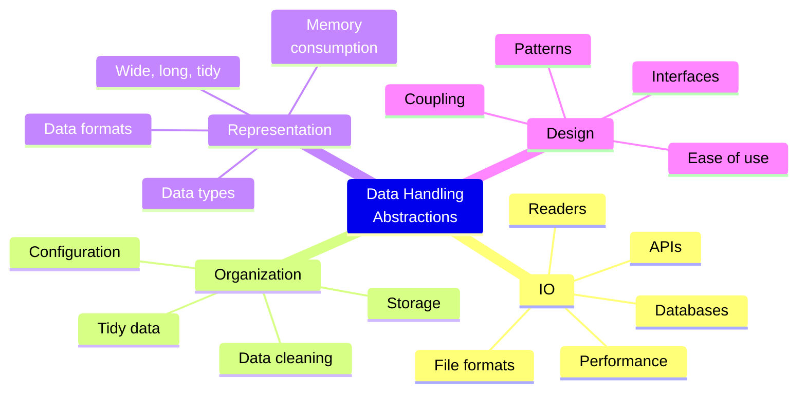

# Data handling and abstractions

## Considerations and perspectives

## Assumptions and limitations

The devised exercises assume that you have working knowledge
of common data science tools and that you can apply these tools to
solve different kinds of problems.

We focus on tabular data, i.e. data that can adequately and conveniently expressed
and processed as a dataframe.

For technical reasons we limit ourselves to:
* Publicly available data sets
* Public APIs that require not authentication
* File based databases
* Data that does not require additional computational resources

## Bring your own topic

You want to discuss a topic that is not yet listed?

Go ahead and make a suggestion!
