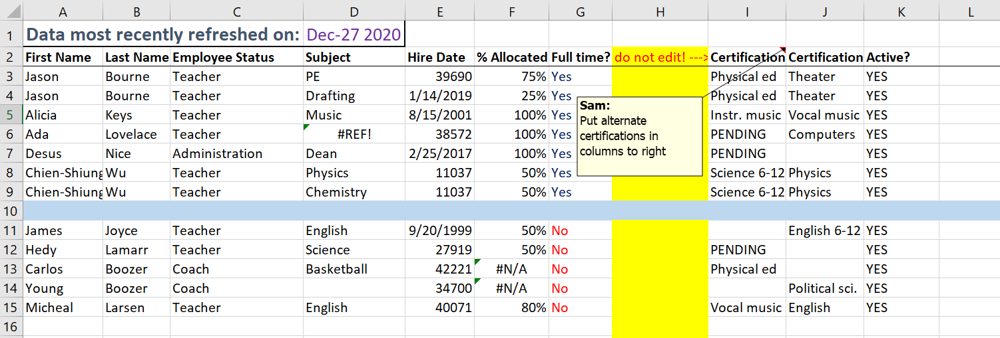

# Clean Dirty Data

Data cleaning is a common aspect of most data processing workflows
and sometimes even a crucial prerequisite.

In this session we want to discuss with different approaches
to clean (or tidy) data.

## Learning goals

* Be able to formulate a definition of *clean* data for a given context
* Be precise about uncertainties

## Session Outline

### Warmup

Share in your team:
* Do you deal with dirty data?
  * What does *dirty* mean in your context?
  * Why is the data dirty in the first place?
* How do you clean your data?

Come up with a definition of *dirty*.

Collect a table of issues you encounter frequently their remedies.

| Issue | Solution |
|-------|----------|
|... | ... |

### Do

Consider this data set, a list of teacher in a fictional high school:

Tasks:
- [ ] Point out the issues that you see.
- [ ] Compare these issues to the list you collected initially.
  - Are there any issues you did not think about in the first place? Why?
- [ ] Discuss how you would clean the data and sketch how the cleaned
      data should look like.
      Be explicit about the decisions you make and aspects where you are uncertain.
- [ ] Introduce suitable data types
- [ ] Document your decisions

If you want to take a look at the underlying Excel: [here](./dirty_data.xlsx)

### Reflect

* What tools can you use to clean data?
* Who is responsible for cleaning data?
* Is *dirt* information?
* At what stage in the process do you usually clean the data?
  * And does it always work that way? Explain.
* How does the choice of data storage influence the *ability to become dirty*?

## Optional: Follow Up

Ideas:
* Implement the cleaning process.
* Consider alternative approaches on how to implement data cleaning,
  for example using one of these tools (if not used already):
  * https://github.com/pyjanitor-devs/pyjanitor
  * https://github.com/sfirke/janitor/

  How does the implementation change? What kind of advantages or
  disadvantages do you see?
