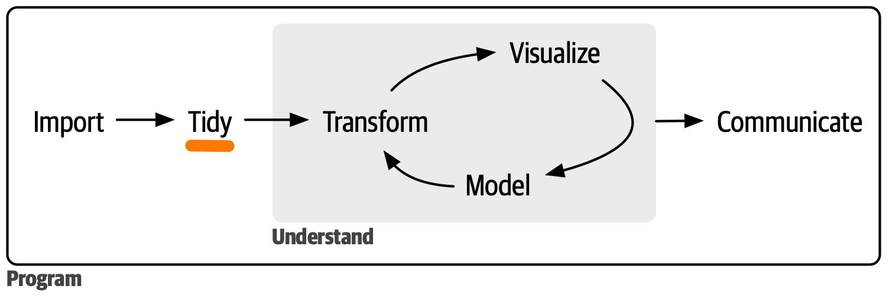

# Facilitate Data Preparation

## Data Cleaning and Tidying

> "Happy families are all alike; every unhappy family is unhappy in its own way."
  — Leo Tolstoy

> "Tidy datasets are all alike, but every messy dataset is messy in its own way."
  — Hadley Wickham

Messy data is a common obstacle in data analysis workflows.
While every dataset can be messy in its own way, there is a consistent
way to organize data using a system called *tidy data* and established
strategies to *clean* data.



In this session we introduce the concept of *tidy* data and
and how to organize data in such a way that we can facilitate
effective data analysis.
We reflect on different strategies to *clean* data.


## Learning Goals

* Understand the concept of *tidy* data
* Identify what make data *messy* and what remedy can be applied to
  make it *clean* and *tidy*
  * Be able to differentiate between data cleaning in general and
    data tidying in particular
  * Establish common strategies
* Learn about tools to support the process

## Warmup

In your team:
* Share what *messy* means in the context of your projects
  and how messy data affects your analysis.
* Discuss how you define *tidy* data in your projects.

Create a list of common issues and how you treat them in your projects.

Try to differentiate the following and discuss similarities and differences:
* Data is *messy* because there are for example missing or
  unreasonable values
* Data is *messy* because you need to prepare it differently
  depending on the kind of analysis you perform.

## Do

*Choose the approach that suits you best.*

**Although most links below point to R-resources, the concept
is not at all related to the programming language and applies
equally elsewhere.**

In any case:
- [ ] Write down questions that arise that you want to discuss with
  your peers.
- [ ] Relate your learning to the projects you work on and how they
  can (or cannot?) be applied there.

### A Small Example

Consider the following scenario:
* We want to investigate cases of tuberculosis (TB)
* We have a dataset providing information on
  * country
  * year
  * population
  * number of cases

The wish to answer the following questions:
* How many cases of tuberculosis were documented per country per year?
* How did the relative number of cases evolve over time per country?
* What is the ratio of affected people in the population?

Let's say the data is provided in the following different forms.

```
# Data set one
table1

## Source: local data frame [6 x 4]
##
##       country year  cases population
## 1 Afghanistan 1999    745   19987071
## 2 Afghanistan 2000   2666   20595360
## 3      Brazil 1999  37737  172006362
## 4      Brazil 2000  80488  174504898
## 5       China 1999 212258 1272915272
## 6       China 2000 213766 1280428583
```

```
# Data set two
table2

## Source: local data frame [12 x 4]
##
##        country year        key      value
## 1  Afghanistan 1999      cases        745
## 2  Afghanistan 1999 population   19987071
## 3  Afghanistan 2000      cases       2666
## 4  Afghanistan 2000 population   20595360
## 5       Brazil 1999      cases      37737
## 6       Brazil 1999 population  172006362
## 7       Brazil 2000      cases      80488
## 8       Brazil 2000 population  174504898
## 9        China 1999      cases     212258
## 10       China 1999 population 1272915272
## 11       China 2000      cases     213766
## 12       China 2000 population 1280428583
```

```
# Data set three
table3

## Source: local data frame [6 x 3]
##
##       country year              rate
## 1 Afghanistan 1999      745/19987071
## 2 Afghanistan 2000     2666/20595360
## 3      Brazil 1999   37737/172006362
## 4      Brazil 2000   80488/174504898
## 5       China 1999 212258/1272915272
## 6       China 2000 213766/1280428583
```

```
# Data set four
table4  # cases

## Source: local data frame [3 x 3]
##
##       country   1999   2000
## 1 Afghanistan    745   2666
## 2      Brazil  37737  80488
## 3       China 212258 213766

table5  # population

## Source: local data frame [3 x 3]
##
##       country       1999       2000
## 1 Afghanistan   19987071   20595360
## 2      Brazil  172006362  174504898
## 3       China 1272915272 1280428583
```

Tasks:
- [ ] What are the pros and cons of each dataset?
- [ ] Which dataset is easiest to work with to answer above questions?
  Why is that the case?


### Further Reading

Links:
* [Hadley Wickham's paper](https://vita.had.co.nz/papers/tidy-data.html)
* [Data tidying in R4DS](https://r4ds.hadley.nz/data-tidy.html)
* [Tidy data in the tidyverse](https://tidyr.tidyverse.org/articles/tidy-data.html)


### Data Cleaning Strategies

*Often the variables themselves need to be cleaned, too.*

Continue on the list you created above and link to useful tools or
functions that simplify the cleaning and preparation process.

For each issue, try to offer at least two (!) strategies that you
can apply to clean the data (or somehow handle the problem).


## Reflect

* What is the benefit of a standardized way to structure data?
* How do you structure your data in your projects?
* Think of a scenario where you prefer *messy* data over *tidy* data.
  * If there is one, explain your preference. What would happen
    if you reorganized the data differently?
* How is *tidy data* related to *[groupy by](https://en.wikipedia.org/wiki/Group_by_(SQL))* or e.g. the exaplanation [here](https://pandas.pydata.org/pandas-docs/stable/user_guide/groupby.html)?
* To which extent is *cleaning* domain specific? What about *tidying*?
* To which extent can *cleaning* and *tidying* be related to the data storage solution?

## Follow Up

Ideas:
* Consider the [HISTALP](../../resources/HISTALP/README.md) data set.
  * How does a *tidy* organization of the data look like?
