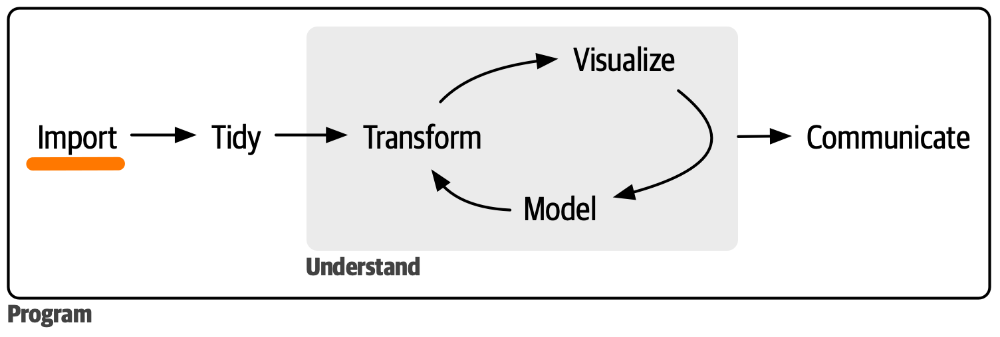

# Try SQL-based databases

In a business or application setting, a lot of data may be
stored in databases.

In this session we provide a starting point on how to
interact with SQL-based relational databases.
While a general introduction SQL or relational databases
is out of scope, it is useful to see how a database can be
accessed to load (and query) data.

Many different database systems exist.
For simplicity, we focus on [SQLite](https://sqlite.com/index.html).

## Learning Goals

* See how a database can be accessed through R/Python to query data
* Provide foundation for future learning

## Session Outline

### Warmup

In your team:
* Share what you know about SQL databases and why they are useful.
* Do you have an SQL database in use?
* Based on your current experience, share use cases and applications
  for databases compared to file-based storage options.

Assuming that everyone is familiar with file-based data sources,
what are your personal experiences with working with databases?

Formulate a set of questions you wish to explore.

### Preparation and additional resources

#### DB Viewer/Editor

To get started, an application to view and eventually edit a database can be helpful.
In this session, we use a SQLite-database.

Apart from dedicated applications, some IDEs and browsers
provide plugins/extensions to view/edit SQLite databases.

#### Official docs and tutorials

It is worth mentioning the following resources:
* [Official SQLite docs](https://sqlite.com/docs.html)
* [A comprehensive tutorial covering a lot of aspects](https://www.sqlitetutorial.net/)
* [Wikipedia on SQL-language](https://en.wikipedia.org/wiki/SQL)

#### A note on security

**Do not hard-code database credentials.**

(In the examples used later, no credentials are needed.)

**Do not manually insert query parameters (using string manipulation).**

See [Wikipedia on SQL injection](https://en.wikipedia.org/wiki/SQL_injection)
and famous *little Bobby tables* (with ([explanation](https://stackoverflow.com/questions/332365/how-does-the-sql-injection-from-the-bobby-tables-xkcd-comic-work) for the curious.))

#### Example databases

We use the [chinook](https://github.com/lerocha/chinook-database/) that is also
discussed in above [tutorial](https://www.sqlitetutorial.net/sqlite-sample-database/).

The [database file](./Chinook_Sqlite.sqlite) is included in this repo.

Tasks:
- [ ] What is this database about?
- [ ] What kind of relationships are depicted in the diagram?
- [ ] If you have an SQLite viewer, go ahead and take a quick look.

### Do

Let's focus on the following scenario:
* A database is given
* We wish to perform a given SQL query
* We wish to execute this query through R/Python and obtain the result of the query in the form of a dataframe

*There can be good reasons to aim for a tighter integration between the
programming language and the database, e.g. through an ORM or other dedicated tools.
However, to limit complexity, it is a good idea to start with explicit SQL-statements
and their execution through the programming language.*

If you are not sure which query to execute, try `SELECT * FROM Genre;` to list
all genres.

Tasks:
- [ ] Connect to the database
- [ ] Execute the query and inspect the result
- [ ] Try different queries, see the [tutorial](https://www.sqlitetutorial.net/sqlite-sample-database/) for ideas
- [ ] Use a query that requires a parameter, for example using `LIMIT <n>`, and find out
      how to pass this parameter

If you use R, see https://rsqlite.r-dbi.org/ and for additional information https://r4ds.hadley.nz/databases as well.

If you use Python, see https://wesmckinney.com/book/accessing-data#io_databases and scroll down to the example where [SQLAlchemy](http://www.sqlalchemy.org/) is used.

### Reflect

* What are differences between a database over file-based storage?
* Discuss scenarios where you would prefer one over the other.
* There is an overlap between functionality provided by e.g.
  SQL and dataframes (and related tools).
  * How do these complement each other?
  * What kind of operations may be carried out in the database and
    what kind of operations in your programming language?

## Follow up

If you are new to SQL, it may be recommended to learn a bit more about SQL and maybe the DBMS that is used in your working context.

If you intend to interact with databases on a regular basis, it makes sense to learn
about the concepts underlying tools such as [DBI](https://dbi.r-dbi.org/) or [SQLAlchemy](https://www.sqlalchemy.org/).
