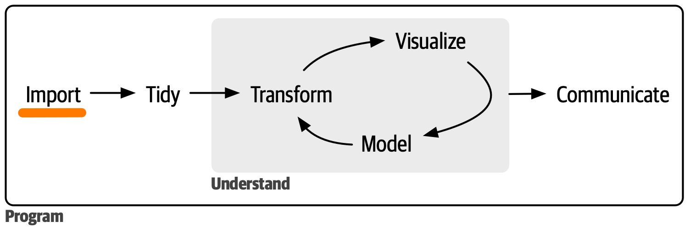

# Understand Data Abstraction

How can we decouple infrastructure concerns and business logic?

For example:
* To which extent does a change in the way we store our data, e.g.
  in the database trigger other changes further downstream in our
  dataflow, e.g. how we retrieve data from said database?
* To which extent do our data processing implementation details
  relate to how we store and manage our data?



Tight [coupling](https://en.wikipedia.org/wiki/Coupling_%28computer_programming%29)
between different components of a system is a typical source
of [technical debt](https://en.wikipedia.org/wiki/Technical_debt).

In this session we experiment with patterns that allow us to introduce
layers/abstractions that help us to separate concerns and establish
clear boundaries between components.


## Learning Goals

* Lean about introducing layers to decouple components
* Establish idea of how such a layer can look in a very simple case

## Session Outline

### Warmup

In your team:
* Discuss how much about the technical details of the data store
  you need to know to load data?
* Share your experience with APIs that allow you to retrieve data
  without directly addressing the underlying data base.
  * How do such APIs shape your development?

### Do

*Let's consider a very simple scenario.*

Imagine we have a some kind of shop or warehouse and the prices
for our product are stored in a database.

When processing an order, we need to look up the price for each product
to compute the total amount.

In pseudocode, something like this:

```python
def compute_total(order):
  total = 0
  for item in order:
    price = # retrieve price from database system <-- COUPLING TO DETAILS
    total += price
  return total
```

As we see, this `compute_total` function directly depends on this database lookup.
It is tightly coupled.

Tasks:
- [ ] Come up with a simple (!) implementation of this use case
  * If you are unsure about the database query, you can replace it by something else.
- [ ] Refactor `compute_total` by injecting the dependency
- [ ] Refactor `compute_total` by injecting an abstract dependency thereby introducing
  an additional layer
- [ ] Swap out the database lookup by some other lookup mechanism to verify that you
  have indeed successfully decoupled `compute_total` from infrastructure concers.

See also:
* [Wikipedia on Dependency Injection](https://en.wikipedia.org/wiki/Dependency_injection)
* [Wikipedia on Dependency Inversion](https://en.wikipedia.org/wiki/Dependency_inversion_principle)


### Reflect

* Who is responsible
* Web APIs
* Fake out; impact re testing


## Optional: Follow up

Ideas:
* Implement the repository pattern as exemplified below.


