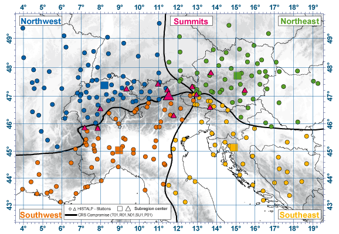

# [HISTALP](https://www.zamg.ac.at/histalp/)

Historical Instrumental Climatological Surface Time Series Of The Greater Alpine Region

## About

The HISTALP project provides monthly homogenised temperature, pressure, precipitation, sunshine
and cloudiness records for the „Greater Alpine Region“ (GAR, 4-19 deg E, 43-49 deg N, 0-3500m asl).
The longest temperature and air pressure series extend back to 1760, precipitation to 1800,
cloudiness to the 1840s and sunshine to the 1880s.

## Data

Apart from its historical significance, the data set is useful for a variety of reasons:
* Small and easy to understand
* Time series than is being updated over time
* Measurements for different locations (data + meta-data)

Parameters:
* `T01`: Mean temperature
* `P01`: Mean station level pressure
* `R01`: Precipitation Totals
* `SU1`: Hours of sunshine

Stations:
* `HEI`: Heiligenblut
* `RAU`: Rauris
* `SON`: [Sonnblick](https://de.wikipedia.org/wiki/Observatorium_Sonnblick)
* `WIE`: Wien-Hohe Warte

See also [download service](https://www.zamg.ac.at/histalp/dataset/station/csv.php).
